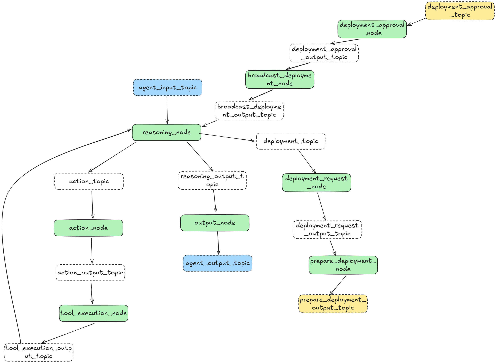

# Graphite Smart Contract Assistant 

An AI-powered smart contract development platform built on the **Graphite** event-driven AI agent framework. Features a Next.js frontend, FastAPI backend with ReAct agents, and MCP (Model Context Protocol) server for intelligent blockchain development assistance with wallet integration and approval workflows.

## Architecture

The application follows a modern 3-tier architecture:



### Components

- **Frontend**: Next.js 14 React application with Wagmi/RainbowKit wallet integration
- **Backend**: FastAPI server with ReAct agents, approval workflows, and event sourcing  
- **MCP Server**: Smart contract generation, compilation, and deployment tools
- **Database**: PostgreSQL for event sourcing, conversation history, and approval tracking
- **Framework**: Built on **Graphite** - an event-driven AI agent framework
- **Blockchain**: Ethereum Sepolia testnet integration with user wallet signing

## Features

### AI Agent Capabilities
- **ReAct Agent Architecture**: Advanced reasoning with THOUGHT → ACTION → OBSERVATION flow
- **Natural Language Processing**: Create smart contracts with conversational prompts
- **Context Awareness**: Persistent conversation history and tool result integration
- **Error Recovery**: Automatic retry logic and fallback handling

### Blockchain Integration  
- **Smart Contract Generation**: ERC20 & ERC721 tokens with advanced features
- **Solidity Compilation**: Automated compilation with OpenZeppelin integration
- **User Wallet Deployment**: Deploy contracts using connected MetaMask/WalletConnect
- **Approval Workflows**: User confirmation for transactions with real-time status
- **Testnet Support**: Ethereum Sepolia testnet integration

### Enterprise Architecture
- **Event Sourcing**: Complete audit trail and state recovery via PostgreSQL
- **Structured Responses**: Type-safe API responses with Pydantic models  
- **MCP Protocol**: Modular tool system for blockchain operations
- **Docker Containerized**: Production-ready deployment configuration

##  Quick Start

### Prerequisites

- Docker & Docker Compose
- Node.js 18+ (for local development)
- Python 3.13+ (for local development)
- MetaMask or compatible Web3 wallet
- Ethereum Sepolia testnet ETH (for deployments)

### 1. Clone Repository

```bash
git clone <your-repository-url>
cd graphite_test
```

### 2. Environment Setup

Copy and configure environment variables:

```bash
cp .env.example .env
```

Edit `.env` with your API keys:

```env
# AI Configuration
OPENAI_API_KEY=
OPENAI_MODEL= # suggest gpt-4o or above

# Blockchain Configuration
# currently supports Metamask only
METAMASK_PRIVATE_KEY= # can be obtained via your metamask wallet
ETHEREUM_SEPOLIA_RPC= # can be obtained via RPC providers e.g., Alchemy, Infura

# pg admin
pg_admin_email=
pg_admin_password=

# MCP server 
MCP_SERVER_URL=http://mcp_server:8081/mcp/

# frontend
NEXT_PUBLIC_API_URL=http://localhost:8000
NEXT_PUBLIC_WALLETCONNECT_PROJECT_ID= # can be left blank

# Backend
BACKEND_API_URL=http://backend:8000

# Postgres
POSTGRES_DB=
POSTGRES_USER=
POSTGRES_PASSWORD=
POSTGRES_HOST=localhost
POSTGRES_PORT=5432

# Phoenix
PHOENIX_ENDPOINT=http://phoenix:4317
OTEL_EXPORTER_OTLP_ENDPOINT=phoenix:4317
```

### 3. Start Application

```bash
# Start all services
docker-compose up --build

# Or run in background
docker-compose up --build -d
```

### 4. Access Services

- **Frontend**: http://localhost:3000
- **Backend API**: http://localhost:8000
- **API Docs**: http://localhost:8000/docs
- **MCP Server**: http://localhost:8081/mcp/
- **pgAdmin**: http://localhost:5050

### Code Quality

```bash
# Linting
ruff check .

# Type checking  
mypy .

# Formatting
ruff format .

```

## Project Structure

```
├── apps/
│   ├── backend/                    # FastAPI backend
│   │   ├── routers/               # API endpoints (chat, approval, wallet, etc.)
│   │   ├── agents/                # ReAct agent implementation  
│   │   ├── memory/                # Conversation context & event extraction
│   │   ├── models/                # Pydantic response models
│   │   ├── event_store/           # PostgreSQL event sourcing
│   │   ├── prompts/               # Agent prompt templates
│   │   ├── deps/                  # Dependency injection
│   │   └── main.py               # FastAPI application entry point
│   └── frontend/                  # Next.js 14 frontend
│       ├── src/
│       │   ├── components/        # React components (Chat, Wallet, Modals)
│       │   ├── hooks/             # Custom React hooks (approval polling)
│       │   ├── services/          # API client & wallet integration
│       │   ├── types/             # TypeScript type definitions
│       │   ├── config/            # Wagmi/RainbowKit configuration
│       │   └── app/               # Next.js App Router pages
│       ├── tailwind.config.js     # Tailwind CSS configuration
│       └── package.json           # Frontend dependencies
├── services/
│   └── mcp_server/               # Smart contract MCP server
│       ├── src/
│       │   ├── servers/          # FastMCP server implementation
│       │   ├── contracts/        # Solidity templates (ERC20, ERC721)
│       │   ├── tools/            # Blockchain tools (deprecated)
│       │   └── models/           # Tool parameter models
│       └── requirements.txt      # MCP server dependencies
├── docker/                       # Docker configurations
├── .env.example                  # Environment variable template
├── docker-compose.yaml          # Service orchestration
├── pyproject.toml               # Python project configuration (uv)
├── uv.lock                      # Python dependency lock file
└── package.json                 # Root package.json (OpenZeppelin contracts)
```

##  Configuration

### Docker Services

- **postgres**: PostgreSQL database
- **pgadmin**: Database administration interface
- **mcp_server**: Smart contract tools server
- **backend**: FastAPI application server
- **frontend**: Next.js web application

##  Usage Examples

### Creating an ERC20 Token with Natural Language

```
User: Create an ERC20 token called "MyToken" with symbol "MTK" and 1 million initial supply

AI Assistant:
THOUGHT: User wants to create an ERC20 token. I need to use the generate_erc20_contract tool to create the contract.

ACTION: generate_erc20_contract
- contract_name: "MyToken"
- token_name: "MyToken"  
- token_symbol: "MTK"
- initial_supply: 1000000
- features: {"mintable": false, "burnable": false, "ownable": false}

OBSERVATION: Successfully generated ERC20 contract with Solidity code

FINAL ANSWER: I've created your MyToken ERC20 contract! Here are the details:

**Contract Details:**
- **Name**: MyToken (MTK)
- **Initial Supply**: 1,000,000 tokens
- **Features**: Standard ERC20 functionality
- **Solidity Version**: ^0.8.27

**Generated Contract:**
```solidity
// SPDX-License-Identifier: MIT
pragma solidity ^0.8.27;

import {ERC20} from "@openzeppelin/contracts/token/ERC20/ERC20.sol";

contract MyToken is ERC20 {
    constructor() ERC20("MyToken", "MTK") {
        _mint(msg.sender, 1000000 * 10**decimals());
    }
}
```
```
Would you like me to compile and deploy this contract to Sepolia testnet?
```
### Deployment with User Wallet Approval

```
User: Yes, deploy it to Sepolia testnet

AI Assistant:
THOUGHT: User wants to deploy the contract. I need to compile it first, then prepare a deployment transaction for the user's wallet to sign.

ACTION: compile_contract → prepare_deployment_transaction

**Approval Required**: Please connect your wallet and approve the deployment transaction:

**Transaction Details:**
- **Contract**: MyToken
- **Network**: Sepolia Testnet  
- **Estimated Gas**: 847,392
- **Gas Price**: 20 Gwei
- **Total Cost**: ~0.017 ETH

[**Approve in Wallet**] ← *User clicks and signs transaction*

**Deployment Successful!**

**Deployment Results:**
- **Contract Address**: `0x742d35Cc7abC5A2C7B8C1C3d3F0F8E2B91d4b3eF`
- **Transaction Hash**: `0x5f9ea17d5b5f4e8c7a2c3b8e9f0a1d2c4e6f8a9b`
- **Block Number**: 18,500,000
- **Deployer**: Your connected wallet
- **Gas Used**: 847,392

**View on Etherscan**: https://sepolia.etherscan.io/address/0x742d35Cc7abC5A2C7B8C1C3d3F0F8E2B91d4b3eF

Your MyToken contract is now live on Sepolia testnet! 🎉
```

## 🛠Technology Stack

### Backend
- **Graphite Framework**: Event-driven AI agent architecture with event sourcing
- **FastAPI**: High-performance Python web framework
- **PostgreSQL**: Event store and conversation persistence
- **FastMCP**: Model Context Protocol for modular tool integration
- **Pydantic**: Type-safe data validation and serialization

### Frontend  
- **Next.js 14**: React framework with App Router
- **Wagmi**: React hooks for Ethereum integration
- **RainbowKit**: Wallet connection UI components
- **Tailwind CSS**: Utility-first CSS framework
- **TypeScript**: Type-safe JavaScript development

### Blockchain
- **OpenZeppelin**: Secure smart contract templates
- **Solidity**: Smart contract programming language
- **Web3.py**: Python Ethereum library
- **Ethereum Sepolia**: Testnet for safe contract deployment

### DevOps
- **Docker**: Containerized development and deployment
- **uv**: Fast Python package manager
- **Ruff**: Python linter and formatter

## Acknowledgments

Built with love using open-source technologies. Special thanks to the Binome team for making this project possible.


